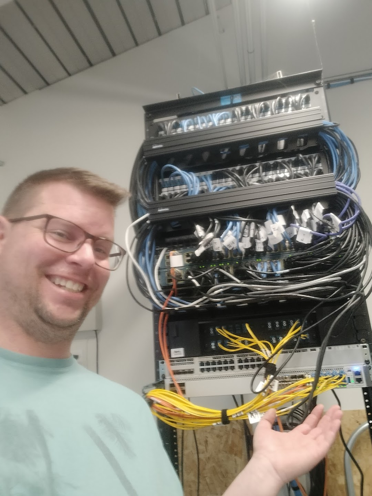

# About

*Building and maintaining network infrastructure - where software meets hardware*

## From Tandy to Today: 30+ Years of Code

I wrote my first program in the early 1990s on a Tandy 486 with 4MB of RAM, running DOS 6.2 and Windows 3.1. Borland Turbo C++ was my first compiler, and I've been hooked on solving problems with code ever since.

I've built my career through hands-on experience, relentless curiosity, and a drive to understand how systems actually work. Over 20+ years of professional experience spanning contracts at companies like Intel and Keysight Technologies to building custom production systems, I've learned that the best education comes from solving real problems - not from following a syllabus.

This autodidact approach has given me a unique perspective: I understand the fundamentals because I had to figure them out myself, often by trial and error. When you learn by doing rather than being told, you develop an intuition for how things break and how to fix them. That skill set - curiosity-driven, problem-solving focused, comfortable with ambiguity - has served me well across multiple technology eras from the early internet to today's blockchain revolution.

## What I Do

** System Administration **

** Life! It's all I/Os **

** Hardware, software **

**Security Research & Bug Bounty Hunting**

My interest in security research started in the early '90s - exploring telecommunication systems, analyzing protocols, and understanding how networks communicate. What began with wardialing modems and studying phone systems evolved into modern security research and bug bounty hunting.

That same curiosity about how systems work (and where they break) drives my current work. I find vulnerabilities by combining deep protocol knowledge with practical exploitation techniques - understanding how things work at a low level makes it easier to spot where they fail.

**Systems Programming**

From raw sockets in C to smart contracts in JavaScript, I work across the full stack. Some problems require bare-metal performance and microsecond-level optimization; others need the speed and flexibility of high-level languages. I use the right tool for the job.

**Full-Stack Development**

Building production systems that solve real problems. I've architected and deployed applications managing thousands of devices, automated critical infrastructure, and created tools that run in production environments serving real users.

**Protocol Analysis & Reverse Engineering**

When documentation doesn't exist or APIs aren't available, sometimes you need to figure out how things communicate by watching the traffic. I enjoy the detective work of decoding proprietary protocols and building interoperability where vendors say it's impossible.

**Hardware & Embedded Systems**

At the end of the day, it's all inputs and outputs - whether you're reading GPIO pins on a microcontroller or parsing JSON from an API. I work with hardware when needed: circuit boards, embedded systems, RF/SDR equipment, and the interfaces between physical devices and software. The principles don't change, just the voltage levels.

## Technical Range

**Languages:** C, Python, JavaScript/Node.js, SQL, Bash  
**Frameworks:** Django, ethers.js, web3.js  
**Specialties:** Network programming, raw sockets, WebSocket protocol, smart contracts, reverse engineering, hardware interfacing  
**Tools:** Wireshark, GDB, Git, Linux systems administration, oscilloscopes, logic analyzers, SDR  
**Domains:** Security research, DeFi/blockchain, systems integration, full-stack web applications, embedded systems

## Why I Write

After two decades in tech, I've learned that the most valuable knowledge comes from solving real problems - not following tutorials or implementing toy examples. This blog documents actual projects I've built and challenges I've solved.

**I write about:**
- Low-level systems programming (because fundamentals matter)
- Protocol analysis and reverse engineering (because documentation lies)
- Production system architecture (because theory and practice diverge)
- Security research (because understanding attacks makes better defenses)
- Modern development (because staying current matters)

Each post represents something I actually built, debugged, or reverse-engineered for a real use case.

## The Long View

Starting in the era of 4MB RAM and 33MHz processors gave me an appreciation for efficiency and performance that persists today. I've watched the industry evolve from command-line interfaces to web browsers to mobile apps to blockchain, and I've written code for each era.

The fundamentals haven't changed - networks still move packets, programs still need memory management, protocols still have specifications. What's changed is the layers of abstraction and the speed at which we can build. Understanding both the foundations and the modern tooling is what makes it possible to work effectively across the full spectrum from bare metal to cloud services.

## Current Focus

**Infra / Helpdesk** not very glamorous but I currently work in the public sector. I enjoy that it's usually something new every day and I get to help people which is rewarding.

**Security research** continues to be a primary interest - finding vulnerabilities, understanding attack surfaces, and helping build more secure systems through bug bounty programs and responsible disclosure.

**Building production systems** that solve real problems, with a particular interest in automation, integration challenges, and systems that work at the intersection of different technology stacks.

**Exploring blockchain and DeFi** as the latest evolution in distributed systems and programmable infrastructure.

## Philosophy

**Ship working code.** Theory is interesting, but production systems need to actually work.

**Understand the fundamentals.** High-level abstractions are great until they break. Know what's happening under the hood.

**Solve real problems.** Tutorials are fine for learning, but real growth comes from tackling actual challenges with real constraints.

**Share knowledge.** The tech community gave me the resources to learn. Documenting what I've learned is how I give back.

## Connect

- **GitHub:** [@voidmanee](https://github.com/voidmanee)
- **LinkedIn:** [Dane Phillips](https://www.linkedin.com/in/dane-phillips-4a8a291a5)

Whether you're interested in collaboration, security research, technical discussions, or have questions about any of the projects documented here, feel free to reach out.

---

*All content on this blog represents personal projects and research. Views and opinions are my own.*
